.. raw:: html

     
    
   
   <big><big><b>
   Sireum Awas Documentation
   </b></big></big>
   
    
   
   <big><big><big><big><b>
   2. Sireum Awas Visualizer
   </b></big></big></big></big>
   

Sireum Awas User Stories
########################
.. highlight:: awas

Sireum Awas visualizer is an HTML5 based web application providing
dependency graphs for AADL systems. Combined with a simple abstract
interpretation engine enables a user to explore and understand an
AADL Model, follow component connectivity, perform risk analysis and
secure information flow analysis.
	       
.. raw:: html
	 
    <big><big><big><b>
    <a href="../../_static/simple_uav/index.html" target="_blank">Demo Awas</a> 
    </b></big></big></big>

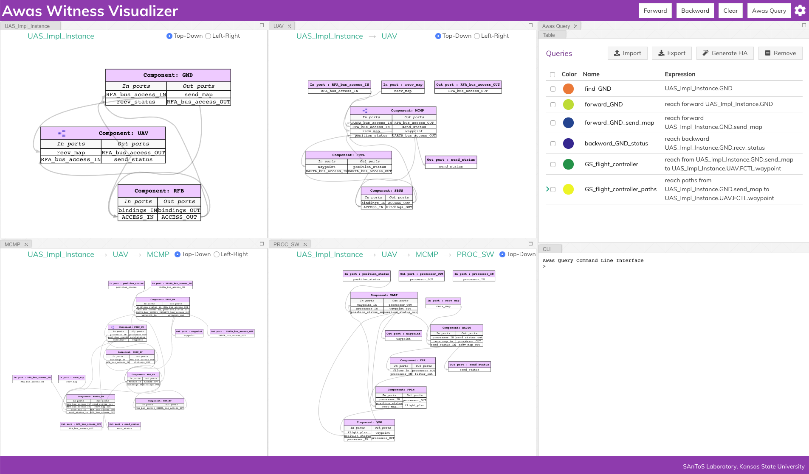

Sireum Awas Capabilities
************************

* Model Navigation: Enables a user to explore a system's model
  without installing modeling tools. Provides the freedom of referring
  the model from both handheld devices and desktops. The user can hide
  irrelevant part of the model and focus on a specific level of
  modeling detail

----

* Dependency Analysis: A system is a composition of components and
  Awas provides insight into the interaction of components through
  component connectivity(inter-component dependency). Along with the
  interaction of ports within a component(intra-component dependency)

----

* Risk Analysis: AADL Annex Error Modeling Version 2(EMV2) provides a
  mechanism to specify the error behavior of a component using
  abstract error tokens. Awas visualizes the propagation of errors in
  a system. Furthermore, Awas helps in finding the root cause of a
  hazardous system state which may lead to an accident

	   
Simple UAV System
*****************

In this section, we illustrate a simple UAV surveillance system that
is used as a running example to demonstrate the capabilities of Awas.

This system consists of a ground station and an Unmanned Aerial
Vehicle(UAV). The primary function of this UAV is to conduct
surveillance over a specified region. This UAV receives the region
information, for instance, a map with the target location and obstacles, from
a ground station. In turn, the UAV sends back status information.

This UAV consists of a mission computer and a flight controller. The
purpose of the computer is to compute a set of waypoints(GPS
coordinates) from a map and a flight pattern provided by the ground
station. The flight controller acts upon these waypoints to progress
on the surveillance task. The UAV sends a corresponding status
code to the ground station whenever it reaches a waypoint.

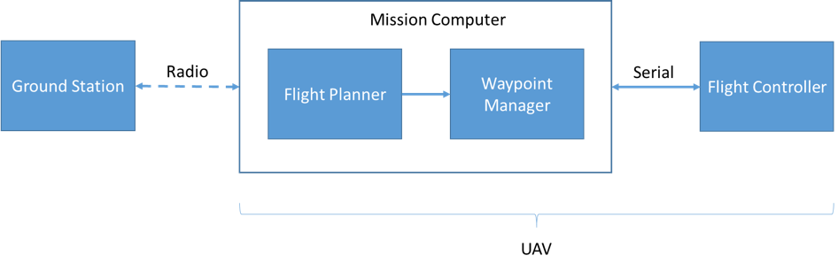

Model Navigation
*****************

OSATE can produce a system implementation diagram from an AADL
system. The following section provides a side by side comparison
between AADL instance diagram and Awas graph for the four systems of
the UAV surveillance model.

.. _UAS system:

UAS: The top level system with ground station and UAV
======================================================

.. raw:: html

  

  

  

  
  

  

  
  

  

Both the AADL diagram and the Awas graph consists of three components
namely GND, UAV, and RFB. However, in the AADL diagram the different
types of components are differentiated by different component
shape. Awas does not distinguish between the types of
components. However, Awas explicitly segregates input and output
ports. For in-out ports, Awas creates two ports one for input and the
other for output. Thus you can see there are two RFA ports in GND
component in the Awas side and only one in the AADL side. Awas also
separates the bidirectional connections into two separate connections.

Awas provides the following model navigation capabilities over OSATE:

1. In Awas, the diagrams are interactive. On clicking a node(component
   and connection), port, or an edge the section of the graph is
   highlighted
2. By default an edge represents an AADL Connection. However, this can
   be modified by the view settings.
3. Awas will highlight an edge along with the ports involved in the
   connection when clicked. Although AADL diagrams can have cleaner
   layouts, the edges involved in complex systems tend to overlap in
   AADL diagrams which can make it tedious to trace an individual
   edge.
4.  
   .. raw:: html
		  
     This icon  in front of a component name
     indicates that this node contains a sub-system. By double-clicking on this node, you can open the sub-system's graph

       
     
UAV - Composed of Mission computer and Flight Controller
========================================================

.. raw:: html

  

  

  

  
  

  

  
  

  

In a sub-system graph, Awas creates the parent component's ports as
nodes. The node ``recv_map`` is same as the port in the UAV component
from the `UAS system`_. Therefore, when clicked on either one of the
port, highlights the port in both the graphs.
  

    
Mission computer - Composed of Radio, UART and Software Components
==================================================================

.. raw:: html

  

  

  

  
  

  

  
  

  

Awas graphs typically contain more edges compared to AADL
diagrams. The additional edges capture the binding relationships
between components. For example, the component ``PROC_SW`` has two
ports ``processor_IN`` and ``processor_OUT`` connecting the component
``PROC_HW``. These edges capture the relation that the ``PROC_SW``
representing the software of the system executes on the hardware
``PROC_HW``. However, AADL diagrams fail to capture these binding
relations and the non-trivial information flow through them.
	 

Software - Composed of drivers and logic for computing the waypoints
====================================================================

.. raw:: html

  

  

  

  
  

  

  
  

  

The Software system consists of drivers ``RADIO`` and ``UART`` that
communicate with the ground station and the flight controller
respectively. Apart from the drivers, the software system consists
of a filter ``FLT`` that checks the wellformedness of a map, and the
components to convert the map into waypoints.

Awas Visualizer Interface
=========================

At the top of the Awas visualizer page, there are five buttons. The
first one from the right is the ``Settings`` button to control the
amount of information displayed in the Awas graph. The next button is
the ``Awas Query`` button used to open the query interpreter and the
results table view. The next three buttons are dependency analysis
buttons discussed in subsequent sections.

Below the top bar is the Awas graph viewer. Each system in the AADL
becomes an Awas Graph, and Awas allows the user to view multiple
systems at the same time by reorganizing the graph viewer window. The
top left of the graph viewer contains a breadcrumb trail that displays
the hierarchy of the current component in relation to the system's
structure.
  
View Options
============

The View Option panel provides the ability to choose what information
will be present in the Awas graph.

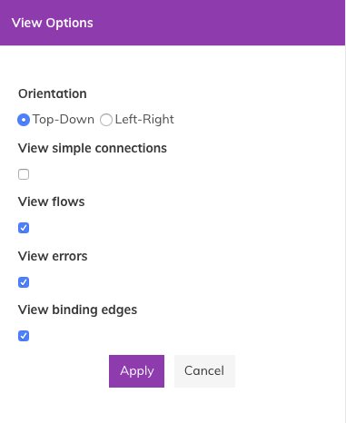

.. warning::
   The `view binding edges` option in the view options panel
   modifies the underlying graph data structure. On large graphs, this
   toggle may take a few seconds to complete. Also, do not perform
   path queries in the presence of a large number of binding
   edges. Doing so may take a long time to evaluate a path query.

Flows
-----

Flows are the AADL construct proving the intra-component dependencies
by relating a component's input and output ports. 

By selecting the checkbox in the settings view, one can view the flow
information in components.

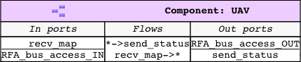

In AADL there are three kinds of flows.

* Flow source - Information originates within a component and flows
  out through its output port. For example, in the flow ``* ->
  send_status`` the ``* ->`` indicates that the information flowing
  out of the port ``send_status`` originates within the component
  ``UAV``

* Flow sink - Information flows into a component but does not flows
  out instead the component consumes the information. Similarly, in
  the flow ``recv_map -> *``, the ``-> *`` indicates that the
  information received on port ``recv_map`` is consumed within this
  component or the subsystem
 

* Flow path - Information flows into the component may be just
  propagated out or transformed and propagated through the
  component. The symbol ``->`` indicates the relation between the
  input and output ports of the component

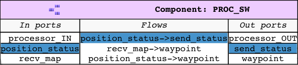

By clicking on a flow, Awas can reveal the relationships between flow
and the ports of a component.

Connections
-----------

In AADL, a user can add flow relations to a connection indicating the
information that influences the communication substrate. The AADL
instance diagram fails to capture these flows. In Awas, users have an
option to view or hide this information. Similarly, connections and
the underlying communication substrate exchange information through
the bindings relations that is missing in AADL instance
diagram. Again, Awas provides an option to view or hide these bindings
relation.

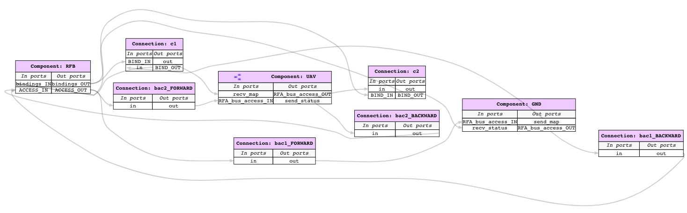

	 

Dependency Analysis
*******************

In model-based design, the primary functionality of a designer is to
translate the system requirements into models. High level requirements
are the connectivity among components. Awas can help in checking if
the connectivity requirements are translated to the design.

Forward and Backward Analysis
=============================

Awas can do two kinds of fundamental dependency analysis based on the
direction of traversal. The user can use them to answer specific
questions such as the following:

.. _Query 1: 

Query 1
   If the ground station sends the map, Where does information regarding the map flow? Also, where is it getting consumed?

   The answer can be obtained by selecting the port ``send_map`` in
   the component ground station and clicking the ``Forward`` button on
   the top of the screen. This action highlights all the ports that
   receive the information from ``send_map``. The flow highlighted
   with a darker shade indicates the consumption of this
   information. If the user wants to go down the hierarchy, they can
   double click on the ``UAV`` component to see the influence of
   ``send_map`` in the subsystems.

   
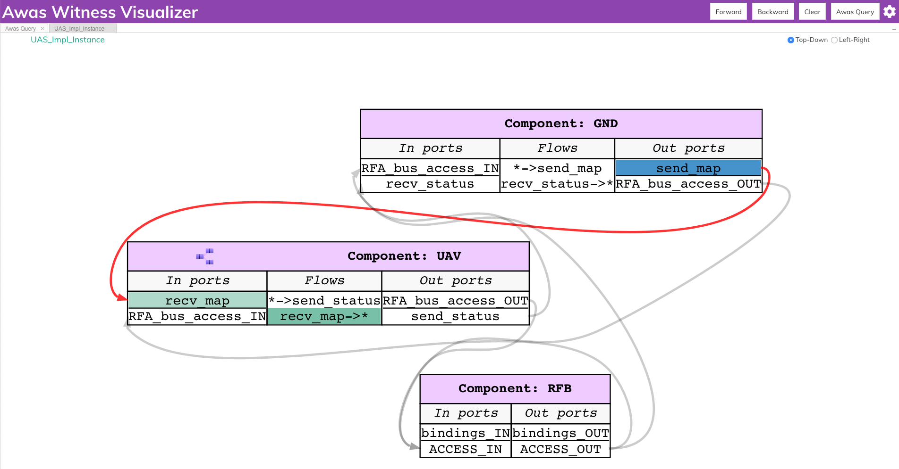

.. _Query 2: 
	 
Query 2
   From where does information needed to compute the ``recv_status`` flow from?

   The user can select the port ``recv_status`` and click on the
   ``Backward`` button on the top right of the screen. This action
   highlights all the ports through which the information needed by
   ``recv_status`` flows. Also highlights the flows that source the
   information in a darker shade.

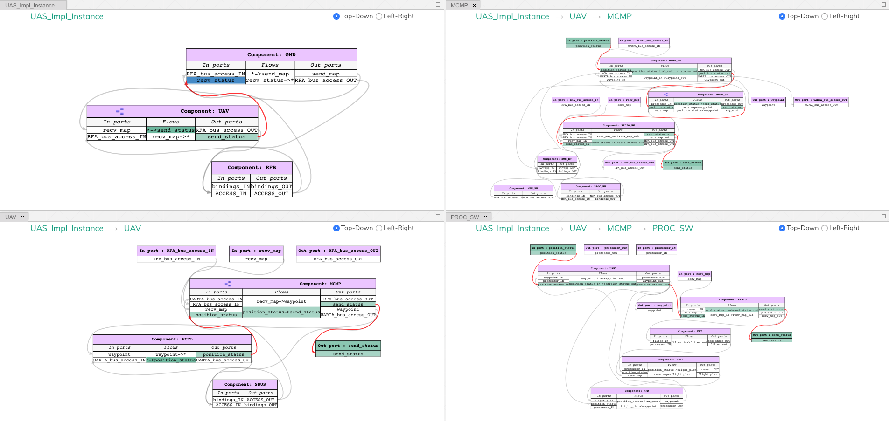

Forward and Backward Analysis in OSATE
======================================

Along with the visualizer, Awas is also integrated with the AADL
instance diagram. OSATE can generate different kinds of AADL diagrams,
among them instance diagram shows a specific composition of the
components in the system. 

.. raw:: html
 
   The Awas plugin provides these icons  
   in the AADL diagram views. They correspond to the forward reachability, backward reachability and erase results. The user can 
   select a component or port in the AADL instance diagram and on clicking the forward or backward reachability icon, the Awas 
   computes the reachability and highlights it on the instance diagram. 

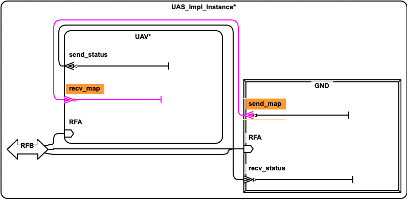

The above image show the result of performing a forward reachability
from the ``send_map`` port in the ``GND`` component. Awas computes
port level reachiability and highlights the connections and ports that
are reachabile form the ``send_map``.  AADL allows user to open the
subcomponents by right clicking on the corresponding component and
clicking show contents. 

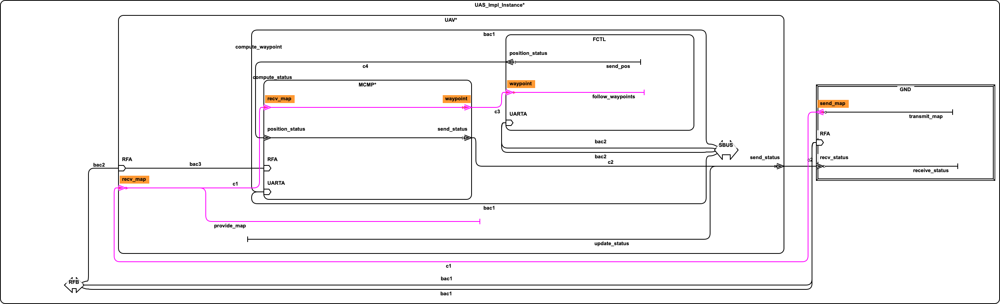

AADL diagrams allows precise customizations of the diagram by hiding
or showing to get only the interested parts of the system to be
displayed. Similar to the forward reachability, bacaward reachability
can be performed from any port or component in the instance diagram.
The user can export the diagram along with the result of the
reachability in to images to include it in other reports.

Dependency Analysis Using Queries
=================================

While performing backward and forward analysis is quick and
straightforward using the buttons, it is not easily reproducible by an
automated regression testing suite. To remedy this, we provide a
simple query language an interpreter inside the Awas visualizer. To
open the query interpreter, click on the ``Awas Query`` button on the
top right corner.
 
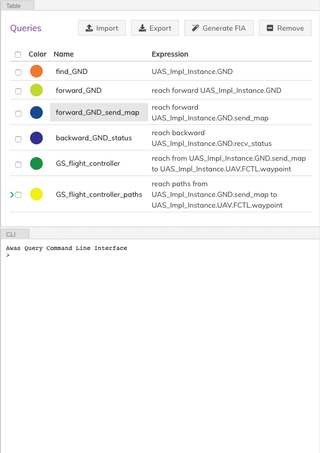

The query view tab contains two additional tabs:

1. Table

   The ``Table`` tab lists the previously executed queries. The color
   in front of each query name indicates the result highlight
   color. Clicking a query name will highlight the query result in the
   graph.

2. CLI

   The CLI provides a terminal for entering the queries.  If there
   exists a solution for the query, the list of graphs containing the
   solution is presented. Also, Awas creates a table entry in the
   ``Table`` tab and stores the result.

   .. image:: query_forward.png
      :align: center	   
      :width: 100%
      :alt: query forward

	 
   The query ``forward_GND_send_map`` performs the same operation of
   the `Query 1`_. 

   .. _forward reach query:

   .. raw:: html

      <table width="100%" > <tr> <td>

   .. code:: 

      forward_GND_send_map = reach forward UAS_Impl_Instance.GND.send_map

   .. raw:: html

      </td> <td style="vertical-align: text-top;"> &nbsp;&nbsp;
      <button id="q1"
      data-clipboard-text="forward_GND_send_map = reach forward UAS_Impl_Instance.GND.send_map">
       </button> </td> </tr> </table>  

   In this query statement, the term before ``=`` is the name of the
   query and everything else is the query expression.

   After the ``=``, there are only two possibilities

   1. Primary Query Expression:

      This can be a canonical representation
      of a node, port, or an error token or a previously executed
      query name. 
      
   2. Reach Expression:

      All reach expressions start with the term ``reach,`` and the
      term after the ``reach`` indicates the direction of reachability
      and the rest of the expression identifies the canonical
      representation of the port ``send_map``.

   .. note:: Awas query expressions are case sensitive.

      
Multiple Query Results
----------------------

The last button to discuss at the top right corner is the ``Clear``
button. This button's purpose is to clear the highlights on the
graph. However, it can be useful to view the results of multiple
queries at the same time.

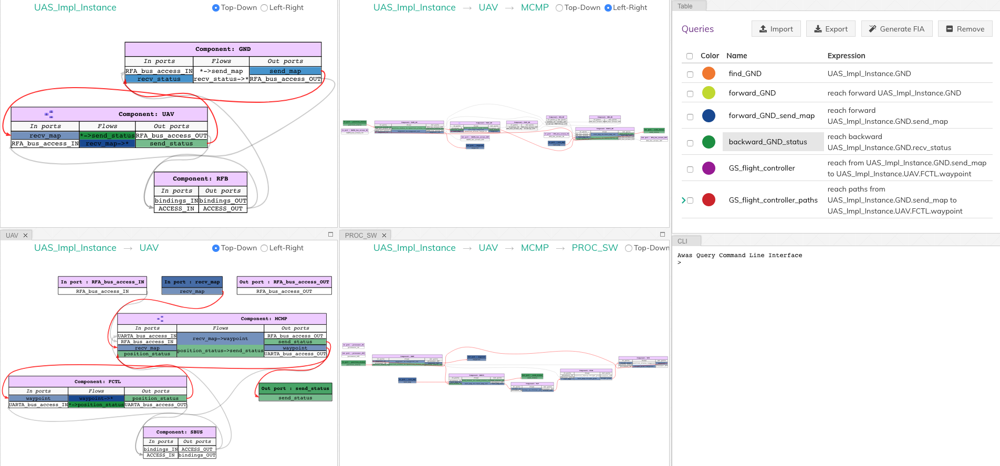

The query ``backward_GND_status`` performs the same action as the
`Query 2`_. By clicking on the button ``backward_GND_status`` without
clearing the result of the previous query we can see the results of
both the queries.

.. raw:: html

   <table width="100%" > <tr> <td>
	 
.. code::
	  
   backward_GND_status = reach backward UAS_Impl_Instance.GND.recv_status

.. raw:: html

   </td> <td style="vertical-align: text-top;"> &nbsp;&nbsp;
   <button id="q2"
   data-clipboard-text="backward_GND_status = reach backward UAS_Impl_Instance.GND.recv_status">
    </button> </td> </tr> </table>  
	 

Complex Queries
===============

The query language's capability goes beyond the simple queries. Using
the queries, the user can compose much more interesting questions.

.. _Query 3: 

Query 3
   when the ground station is sending the map, how does it get to the flight controller?

   The striking distinction between `Query 3`_ and the previous
   queries is the number of arguments in the query. In this query, the
   user asks if it is possible to reach the flight controller from the
   ground station, show how it is possible? In contrast, the previous
   queries only showed how the information flowed into or out of a
   specific node, port or error token.

 
Source to Destination Query
---------------------------

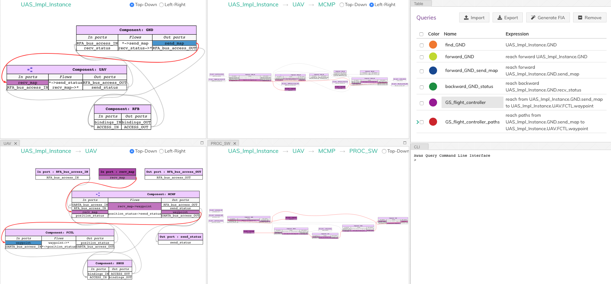

The following Awas query statement captures the user's `Query 3`_

.. raw:: html

   <table width="100%" > <tr> <td>

.. code::
   
   GS_flight_controller = reach from UAS_Impl_Instance.GND.send_map to UAS_Impl_Instance.UAV.FCTL.waypoint

.. raw:: html

   </td> <td style="vertical-align: text-top;"> &nbsp;&nbsp;
   <button id="q3"
   data-clipboard-text="GS_flight_controller = reach from UAS_Impl_Instance.GND.send_map to UAS_Impl_Instance.UAV.FCTL.waypoint">
    </button> </td> </tr> </table>  

This is again a reach expression. However, the direction of the
reachability is replaced by the term ``from`` followed by the
canonical representation of the source of information and the term
``to`` followed by the destination point of the information flow.

The source and sink can be any two nodes, ports, or error tokens. If
the source and sink are transitively reachable, then Awas highlights
results, otherwise Awas will indicate the flow is infeasible.
	 

Path Queries
------------

Using the previous query, Awas can capture the information flow
between a source and destination, and yet, there are multiple ways
information can flow from source to destination. If one wishes to
enumerate all the individual paths, they can alter the above Awas
query as follows.

.. raw:: html

   <table width="100%" > <tr> <td>

.. code::
   
   GS_flight_controller_paths = reach paths from UAS_Impl_Instance.GND.send_map
                                              to UAS_Impl_Instance.UAV.FCTL.waypoint

.. raw:: html

   </td> <td style="vertical-align: text-top;"> &nbsp;&nbsp;
   <button id="q4"
   data-clipboard-text="GS_flight_controller_paths = reach paths from UAS_Impl_Instance.GND.send_map to UAS_Impl_Instance.UAV.FCTL.waypoint">
    </button> </td> </tr> </table>  

The addition of the term ``paths`` instructs Awas to enumerate all the
paths. This action suddenly converts the simple reachability problem into an
exponentially complex problem as there can be an infinite number of
paths if there is a cycle in the graph. Our solution to this problem
is to enumerate all the paths without cycles and paths with all the
relevant cycles. For example, suppose there exist a simple
path A, i.e. path without any cycle. Furthermore, assume there are
cycles in the graph, and the nodes of the cycles overlap with the nodes
of the path A. Then we create a complex path with all the nodes of the
path A and the cycles whose nodes overlap with path A.

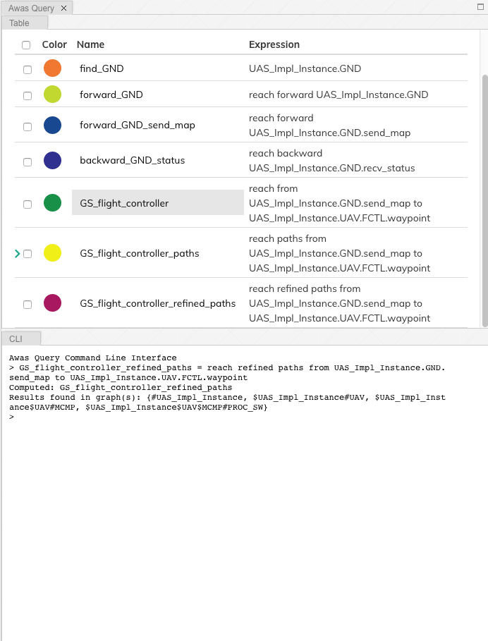

In the query view, you can see a little arrow in front of the query
name which indicates the existence of more than one path. Clicking the
arrow will show the list of paths. If one wishes to view only the
paths that do not contain cycles, then they can use the keyword
``simple``.

.. raw:: html

   <table width="100%" > <tr> <td>

.. code::
   
   GS_flight_controller_simple_paths = reach simple paths from UAS_Impl_Instance.GND.send_map
                                                            to UAS_Impl_Instance.UAV.FCTL.waypoint

.. raw:: html

   </td> <td style="vertical-align: text-top;"> &nbsp;&nbsp;
   <button id="q5"
   data-clipboard-text="GS_flight_controller_simple_paths = reach simple paths from UAS_Impl_Instance.GND.send_map to UAS_Impl_Instance.UAV.FCTL.waypoint">
    </button> </td> </tr> </table>    
   
The result of the above query list three paths. Yet, we know there is
only one path from the ground station ``send_map`` to the flight
controller ``waypoint``. This doesn't mean Awas is incorrect. Awas is
producing all the paths which include paths that flow using
intra-component flow rather than the inter-component flows in the
sub-graph. To obtain only the refined paths, one can use the term
``refined`` in the query.

.. raw:: html

   <table width="100%" > <tr> <td>

.. code::
   
   GS_flight_controller_refined_paths = reach refined paths from UAS_Impl_Instance.GND.send_map
                                                            to UAS_Impl_Instance.UAV.FCTL.waypoint

.. raw:: html

   </td> <td style="vertical-align: text-top;"> &nbsp;&nbsp;
   <button id="q6"
   data-clipboard-text="GS_flight_controller_refined_paths = reach refined paths from UAS_Impl_Instance.GND.send_map to UAS_Impl_Instance.UAV.FCTL.waypoint">
    </button> </td> </tr> </table>    							   
   

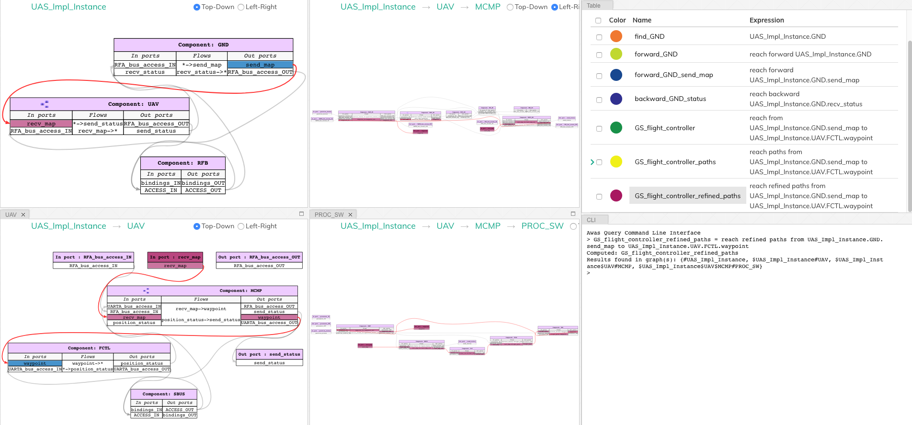

	 

Path Based Filter
-----------------

What if only some of the paths listed are of interest to the user?
Alternatively, what if the user wishes to see only the paths
flowing through a component of interest. In these situations, the
filtering capability of Awas can come in handy.

.. _Query 4:

Query 4
   When the ground station is sending the map, is it always flowing through the filter component?

   The filter component in the ``PROC_SW`` subsystem filters out the
   maps that are not well-formed. A User can check this by asking is
   there a path from ground station to flight controller without going
   through the filter component. If there are no paths found then we
   can conclude that all the paths flow through the filter
   component. If a path exists that does not flow through the filter,
   Awas projects it on the graphs and presents the list of Awas graphs
   containing the result.

The following Awas query can answer `Query 4`_.

.. raw:: html

   <table width="100%" > <tr> <td>

.. code::

    GS_flight_controller_refined_paths = reach refined paths from UAS_Impl_Instance.GND.send_map
                                                               to UAS_Impl_Instance.UAV.FCTL.waypoint
							          with none(UAS_Impl_Instance.UAV.MCMP.PROC_SW.FTL:port)

.. raw:: html

   </td> <td style="vertical-align: text-top;"> &nbsp;&nbsp;
   <button id="q8"
   data-clipboard-text="GS_flight_controller_refined_paths = reach refined paths from UAS_Impl_Instance.GND.send_map to UAS_Impl_Instance.UAV.FCTL.waypoint with none(UAS_Impl_Instance.UAV.MCMP.PROC_SW.FTL:port)">
    </button> </td> </tr> </table>        

Clicking on the query name from the query view table will cause a
``The result is empty`` message to appear at the bottom right of the
screen.

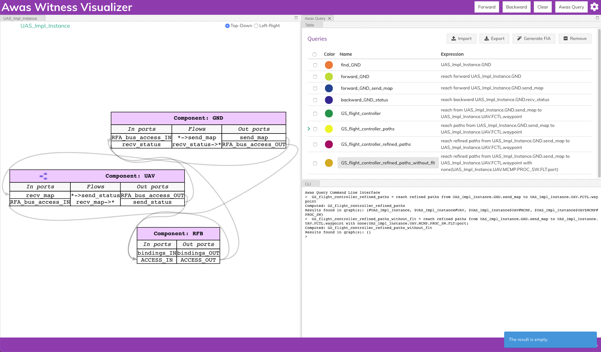

There are a few new terms contained the the previous query:

1. ``none``: This term filters the paths that do not contain the node, port, or error token specified. Similarly, there are two more terms:
   
   * ``all``: This term filters the paths containing all of the node, port, or error token specified
   * ``some``: This term filters the paths containing at least one of the specified node, port, or error token

2. ``:port``: This term pulls out all the ports from a component. Similarly one can specify the following self descriptive terms
   
   * ``:node``
   * ``:port-error``
   * ``:in-port``
   * ``:out-port``
   * ``:error``
   * ``:source``
   * ``:sink``

Risk Analysis
*************

With the help of the error token propagation mechanism, the user
can model the error behavior of the system. Using Awas, the user
can compute the flow of errors in the system and may pose the
following questions:

Query 5
   Is there a possibility of a hazardous situation arising throughout the system operation?

QUery 6
   What are the root causes of a specific hazardous situation?

In our UAV system, we do not have any defined safety constraints
yet. However, we do have some of the security-related properties. In
the UAV system, one of the security property is that only the
authorized party can communicate with the UAV. We can abuse the AADL
EMV2 language constructs to model these simple properties and use Awas
on top of it.

.. _Query 7: 

Query 7
   Do only authorized and well-formed maps reach the flight controller?

   We can check this using Awas by the following query:

   .. raw:: html

      <table width="100%" > <tr> <td>
   
   .. code::
      

      only_wellformed_authorized = reach paths from (UAS_Impl_Instance.GND.send_map:port-error)
                                                 to (UAS_Impl_Instance.UAV.FCTL.waypoint:port-error)

   .. raw:: html

      </td> <td style="vertical-align: text-top;"> &nbsp;&nbsp;
      <button id="q7" data-clipboard-text="only_wellformed_authorized = reach paths from (UAS_Impl_Instance.GND.send_map:port-error) to (UAS_Impl_Instance.UAV.FCTL.waypoint:port-error)">
       </button> </td> </tr> </table>    

      
To view the results, first, we have to enable the ``view errors``
checkbox in the view settings. Clicking on the query name form the
query view, we can notice only the ``wellformed_authenticated`` token
is highlighted. This shows neither ``unauthenticated`` nor
``not_wellformed`` reaches the flight controller.

Also notice the use of ``port-error`` term instead of listing each
error token in the query. The following query's behavior is identical to `Query 7`_.

.. code::
      
   only_wellformed_authorized = reach paths from UAS_Impl_Instance.GND.send_map{UAS_Errors.wellformed_authenticated, UAS_Errors.not_wellformed_unauthenticated, UAS_Errors.not_wellformed_authenticated, UAS_Errors.wellformed_unauthenticated}
					      to UAS_Impl_Instance.UAV.FCTL.waypoint{UAS_Errors.wellformed_authenticated}

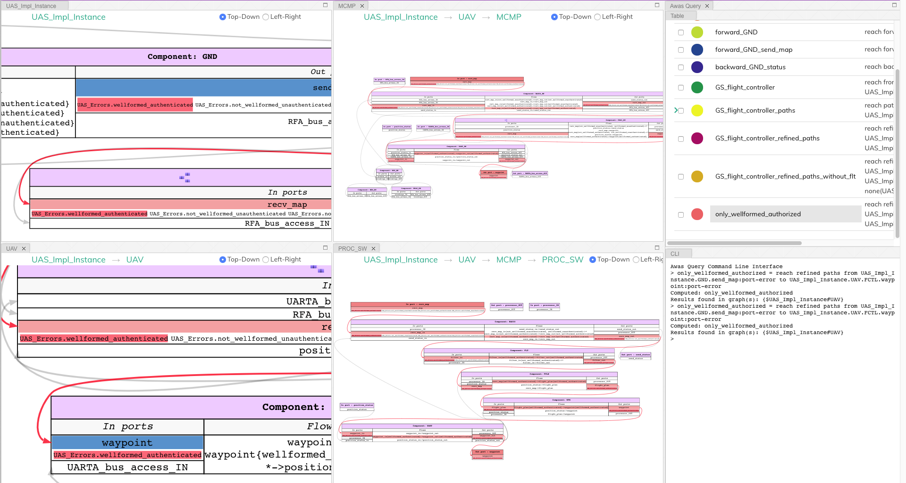

Query Language Grammar
**********************

.. code:: antlr-python
	  
        modelFile 
	    : model EOF
            ;

        model
            : queryStatement+ 
            ;

        queryStatement
            : ID '=' queryExpr 
            ;

        queryExpr
            : 'reach' reachExpr ((('-' | 'union' | 'intersect') queryExpr) | ':' filter)?
            | primaryExpr ((('-' | 'union' | 'intersect') queryExpr) | ':' filter)?
            ;

        reachExpr
            : ('forward' | 'backward') queryExpr 
            | 'from' queryExpr 'to' queryExpr
            | ('refined')? ('simple')? 'paths from' queryExpr 'to' queryExpr 'with' withExpr     
            ;

        withExpr
            : ('some' | 'all' | 'none') '(' queryExpr ')'  
            ;    

        primaryExpr
            : nodeNameError
            | '(' queryExpr ')'
            | '{' nodeNameError (',' nodeNameError)+ '}'  
            ;

        filter
            : node
            | port-error
            | port
            | in-port
            | out-port
            | error
            | source
            | sink
            ;    

        nodeNameError
            :  nodeName error? 
            ;    

        nodeName
            : ID('.' ID)*   
            ; 

        error
            : '{' errorId (',' errorId)* '}' 
            ;

        errorId
            : ID ('.' ID)*
            ;    

        ID
            : ([A-Z] | [a-z]) ([A-Z] | [a-z] | [0-9]| '_')*
            ;    

Known Issues
************

* High page load time: Currently, the graph rendering and the graph cycles are computed
  during the page load and when enabling or disabling the ``View
  binding edges``. Therefore, for a large model, this may take a while to compute

  - Solutions in development:
    
    1. Use web workers to render in the browser parallelly
    2. Launch a local server from the OSATE plugin, upon opening the
       Awas visualizer, process the graphs in the server rather than
       the browser

  .. Warning::
     Do not perform path queries when the ``View binding
     edges`` option is enabled. For a large system with a lot of
     binding edges, this may take a while to compute.

* Regular expressions to filter the paths

  - Solution in development:
    
    1. Currently the query language supports regular
       expression. However, the underlying algorithms are in
       development

* AADL EMV2 supports state transformation and component and compound
  error behaviors.

  - Solution in development:
    
    1. As a first step, weakest precondition calculus is being
       developed on top of Fault Propagation and Transformation
       Calculus(FPTC)

    2. Long term goal: Discharge the query specific sub system to model checkers e.g. AltaRica, etc.

* Some browsers may restrict images or script elements when opened as a local HTML files

       
       

     

 

 
