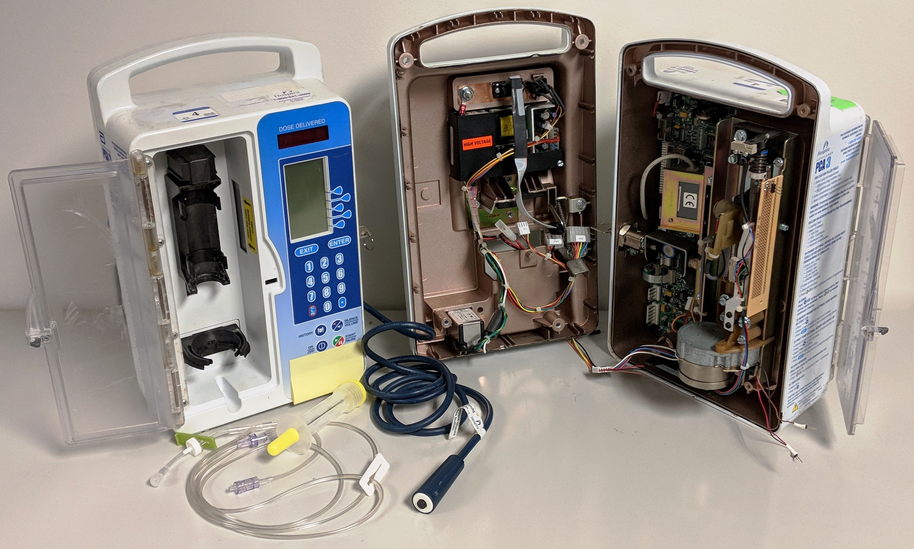
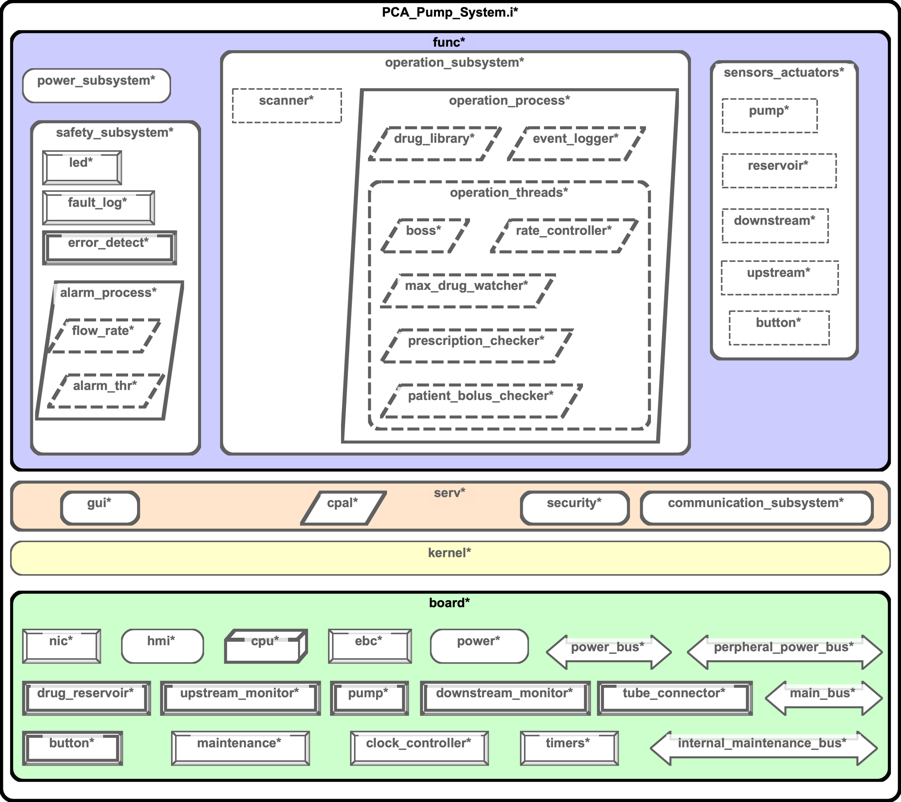
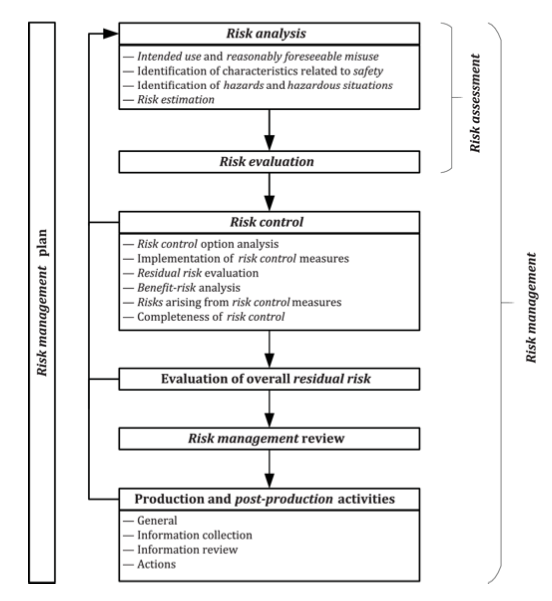
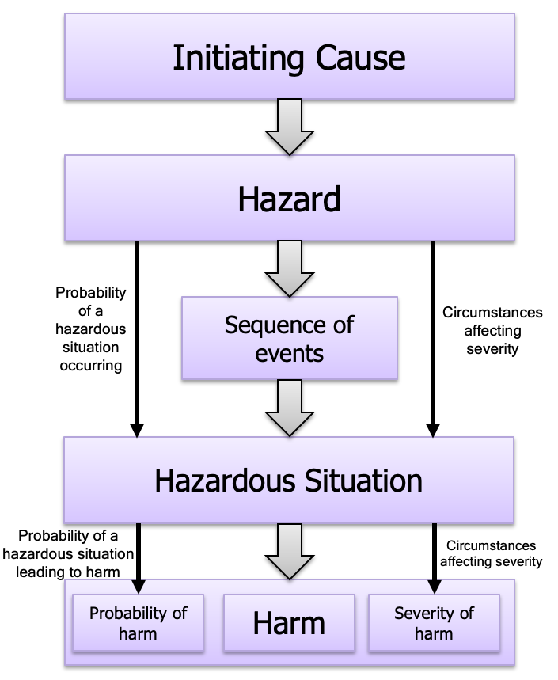
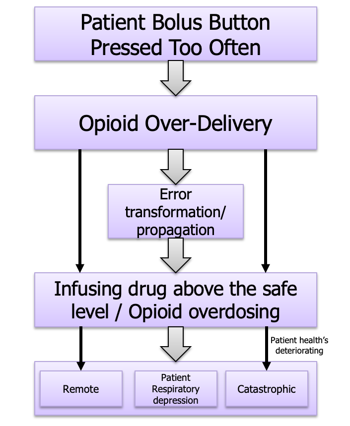
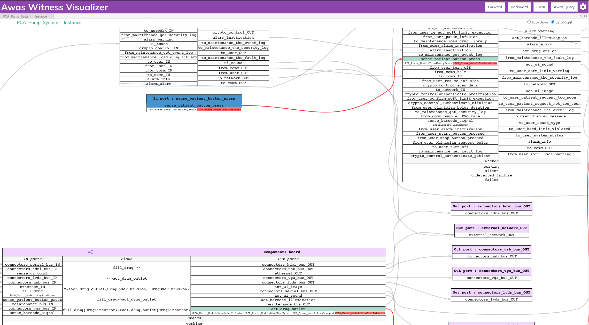
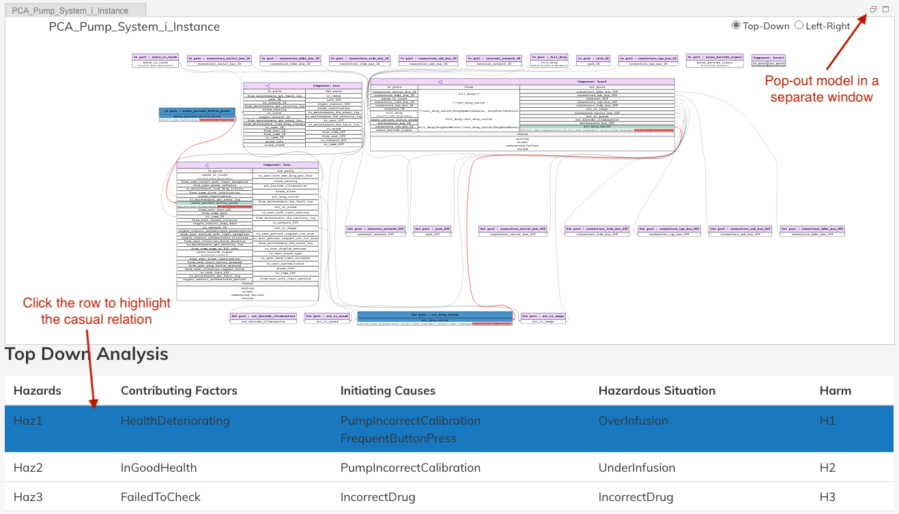

.. raw:: html

     
    
   
   <big><big><b>
   Sireum Awas Documentation
   </b></big></big>
   
    
   
   <big><big><big><big><b>
   3. Risk Analysis
   </b></big></big></big></big>
   

Sireum Awas Risk Analysis
#########################

In the context of Model-Based System Engineering (MBSE), risk
management is an essential part of developing critical
systems. Although interleaved into every facet of the system
development process, artifacts generated in the process are necessary
for obtaining regulatory certifications. Risk analysis, part of the
risk management, consists of a tedious process of finding causes for
reasonably foreseeable system failures. Awas's reachability analysis
and visualization capabilities are useful in exploring and
communicating the failure scenarios and in ensuring the effectiveness
of the measure taken to eliminate failures.

.. _(TL;DR Open PCA Pump Awas ISO 14971 Report): ../../_static/open-pca-report/risk-analysis-report.html

ISO 14971/AAMI 80001 `(TL;DR Open PCA Pump Awas ISO 14971 Report)`_
******************************************************************* 

In the medical domain, ISO 14971 is the widely adopted international
standard for risk management. The following sections describe: 

* Description of the OpenPCA Pump medical device model

* The application of ISO 14971 to Open PCA Pump model and the use of
  AADL properties to capture risk management concepts. Open PCA Pump
  Model and the application of ISO 14971 properties available at:

  .. raw:: html

     <table width="100%" > <tr> <td>

  .. code:: bash

     https://gitlab.cs.ksu.edu/open-pca-pump/artifact-open-pca-aadl

  .. raw:: html

     </td> <td style="vertical-align: text-top;"> &nbsp;&nbsp;
     <button id="copyMacDevelopment"
     data-clipboard-text="https://gitlab.cs.ksu.edu/open-pca-pump/artifact-open-pca-aadl.git">
      </button> </td> </tr> </table> 

* Use of Error Modeling Version 2(EMV2) annex and Awas reachability
  analysis to accomplish crucial steps in the ISO 14971 risk
  management process

.. _Model-based Risk Analysis for an Open-Source PCA Pump using the AADL Error Modeling Annex: ../../_static/awas-ISO14971-risk-analysis.pdf

The work on this section is reported on in a currently submitted paper `Model-based Risk Analysis for an Open-Source PCA Pump using the AADL Error Modeling Annex`_

.. raw:: html

  <iframe src="https://drive.google.com/file/d/1aCNSbSIsfdSusRKR7BP1m4C0o3t3GLuP/preview" width="100%" height="648"></iframe>

OpenPCA Pump Model
------------------

In this section, we illustrate (Open Patient Controlled Analgesic)
Open PCA Pump medical device model. In the subsequent parts of this
document, we use this model to demonstrate Awas’s application in the
risk analysis process.

Background
~~~~~~~~~~

A PCA pump is a medical device used for pain management in a variety
of clinical settings intended to administer opioids through
intravenous(IV) infusion. Typically, a caregiver assembles the pump
with the opioid and configures it based on the prescription. The
prescription may include information such as the medication, quantity,
rate of flow, and duration. On infusing the drug, the pump may operate
on either in basal mode or bolus mode. In basal mode, the infusion of
the drug happens at a constant rate of flow. In bolus mode, the pump
operates at a high rate for a short period. The bolus (handheld
switch) provided to the patient activates the bolus mode
infusion. However, frequent activation of the bolus poses a severe
overdose threat to the patient. Historically, PCA Pumps have harmed
the patients and led to a patient’s death due to over infusion.

Design
~~~~~~

We constructed the Open PCA Pump model based on the ISOSCELES medical
device reference architecture. The reference architecture suggests the
separation of functional components from the physical components. It
also provides templates for generic subsystems such as operation,
safety, user interface, network interface, power, and
sensor/actuators.

The top level of the functional subsystem separates the safety
subsystem from the rest of the that detects and mitigates the faulty
behaviors. Error modeling covers both physical and functional
subsystems, and the errors flow from physical to functional subsystems
and vise versa via the AADL bindings mechanism.

ISO 14971/AAMI 80001
--------------------

ISO 14971 is a risk management standard intended for medical device
manufacturers. In the medical device context, the risk is related to
injury to the patient and other users such as clinicians. Risk
analysis is a part of the risk management process in which Awas can
assist an analyst in identifying, communicate, and mitigate risk.

Risk Analysis
~~~~~~~~~~~~~

ISO 14971 concepts related to risk analysis

* Harm: Injury or damage to the health of people, or damage to property or the environment 

* Hazard: Potential source of harm

* Hazardous Situation: Circumstance in which people, property or the environment is/are exposed to one or more hazards

* Initiating cause: Faults or other issues that lead to a hazard

The below figure illustrates the relationships between these terms. 

Risk Analysis Process
~~~~~~~~~~~~~~~~~~~~~

The medical device manufacturer performs risk analysis and records the
risk analysis activities and their results in the risk management
file. The regulatory authorities check for device compliance by
inspecting the risk management file. The manufacturer shall perform
the following risk analysis steps:

1. Identify intended use and reasonably foreseeable misuse

2. Identification of characteristics related to safety

3. Identification of hazards and hazardous situations

4. Risk estimation

Risk Analysis Sample Scenario
~~~~~~~~~~~~~~~~~~~~~~~~~~~~~

Consider the scenario where a patient presses the bolus multiple times
in a short duration. If the pump infuses the drug each time, there is
a possibility of overdosing the patient. In this scenario, over
infusion is the hazard, and overdosing is the hazardous situation. The
below figure provides the expected result of performing the risk
analysis process for this scenario.

AADL 14971 Property template
----------------------------

We took advantage of the user-definable property types feature of AADL
and developed a set of properties to capture ISO 14971 concepts in an
AADL model. Installing the Awas Osate plugin provides this template as
part of the plugin contributions. The Awas plugin can be installed as
described in section :ref:`Sireum Awas pluging for OSATE`.

.. literalinclude:: code/ISO14971_80001.aadl
      :language: aadl
      :linenos:

We demonstrate the purpose and use of this property template in the risk
analysis of AADL models in the following walk-through section.

Risk Analysis Walk-though: Analyst Perspective
----------------------------------------------

As the risk analysis process prescribes, the first step in risk
analysis is to identify the intended use and misuse of the medical
device. In the case of an Open PCA pump, the primary purpose of the
pump is to infuse opioids for pain management. One possible misuse
would be over infusing of the opioid to the level that it may harm the
patient. Also, there is a possibility of delivering the wrong drug
into the patient or in an incorrect dosage.

The next step would be identifying hazards and hazardous situations. A
hazardous situation includes the possible triggering mechanism for
hazards to develop in the system and the ways it can lead to harming
the patient, clinicians, or the environment.

In an AADL model with error propagation, hazards are a particular
combination of errors that may flow through the system’s external
ports and harm the patient or the user of the device. In the case of
the PCA pump, over-infusion on the port drug_outlet can cause an
overdose in the patient when the patient’s health is
deteriorating. With the following instantiation of ISO14971
properties, we can capture the hazardous scenario in the AADL model.

- Hazard
  
  .. code:: aadlproperty

	Haz1 : constant ISO14971_80001::Hazard => [
		ID => "Haz1";
		Description => "Drug over-infusion";
	];

- Hazardous Situation

  .. code:: aadlproperty

	OverInfusion : constant ISO14971_80001::Hazardous_Situation => [
		ID => "OverInfusion";
		Description => "Infusing drug when the patient's health is deteriorating";
		Hazard => Hazards::Haz1;
		Paths_to_Harm => ([
	          Harm => Harms::H1;
		  Contributing_Factors => (ContributingFactors::HealthDeteriorating);
		  Probability_of_Transition => Remote;
		]);
		Risk => High;
		Probability => Remote;
	];

- Harm

  .. code:: aadlproperty
       
    	H1 : constant ISO14971_80001::Harm => [
		ID => "H1";
		Description => "Patient Overdosed";
		Severity => Catastrophic;
	];

Similar to the hazards, using the properties, an analyst can capture
the initiating causes leading to the hazards. Followed by, with the
help of tools such as fault impact analysis, Awas's reachability
analysis, etc. An analyst can compute the sequence of events from an
initiating cause to a hazard. Thus providing a complete picture of a
hazardous situation.

- Initiating Cause
  
  .. code:: aadlproperty

	IncorrectDrug : constant ISO14971_80001::Cause => [
		ID => "IncorrectDrug";
		Description => "Incorrect drug loaded into pump";
		Probability =>  Frequent;
	];

We associate the EMV2 error type propagation with the ISO 14971
properties to compute the causality between the initiating causes and
hazards. In the below property, we associate the earlier defined
hazard ‘Haz1’ with the ‘DrugOver Infusion’ error propagating out of
the system. Similarly, we can associate the cause
‘FrequentButtonPress’ with the error ‘TooSoonPress’ on port’
patient_button_press’. One can calculate the causality relation
between the cause ‘FrequentButtonPress’ and hazard ‘Haz1’ by computing
the reachability between these two port-error pairs.

- Hazard

  .. code:: aadlproperty

          ISO14971_80001::Hazards => (Hazards::Haz1) applies to act.drug_outlet.DrugOverInfusion;
	

- Cause

  .. code:: aadlproperty

          ISO14971_80001::causes => (Causes::FrequentButtonPress) applies to sense.patient_button_press.TooSoonPress;

Awas Visualization
------------------

An analyst can use the Awas visualizer demonstrated in section
:ref:`Sireum Awas Visualizer` to identify and communicate casual
relationships to develop an appropriate mitigation strategy. Backward
reachability from the port-error associated with the hazards can
provide all the initiating causes and the following sequence of events
that lead to the hazard. With the project causal path on the model, an
analyst can identify missed out causes, appropriate mitigation
strategy, and communicate with the rest of the engineering team.

The link below provides the visualization for the Open PCA Pump model.

.. raw:: html
	 
   <big><b>
    <a href="../../_static/open-pca-viz/index.html" target="_blank">Open PCA Pump Awas Visualization</a> 
    </b></big>

Awas Report
-----------

One of the contributions of this work is the ability to generate a
report with casual scenarios. The report consists of tables comprising
the harms, hazards, hazardous situations, initiating causes, and the
relationship between the causes and hazardous situations in both
forward and backward directions. The report also includes the model
represented in a dedicated version of Awas visualizer that supports
reporting (this dedicated visualization is linked directly to report
functionality; for full Awas functionality with forward and backward
reachability and the querying capability, use the full Awas
visualization presented in the link above). In the report
visualization, clicking the table rows will direct Awas to highlight
automatically discovered error flows through the AADL model that
reflect with causal relationships between root causes and hazardous
situations.

For better viewing, the analyst can pop out the model into a bigger
window and view casual relationships. Popping out the model
visualization enables generating a printable version of the tables and
including it in the risk management artifacts. The below link provides
a sample report for the Open PCA Pump model.
     
.. raw:: html
	 
    <big><b>
    <a href="../../_static/open-pca-report/risk-analysis-report.html" target="_blank">Open PCA Pump Awas ISO 14971 Report</a> 
    </b></big>
 
One can generate similar report for any AADL model with EMV2 and the ISO14971 properties by following these steps: 

1. Generate the instance model from an AADL system implementation (menu 'Help -> Help Contents -> OSATE Core Documentation -> Instantiating Your Model')
2. Select the generated instance model and select 'OSATE -> Sireum HAMR -> Generate Risk Analysis Report' from the menu
3. Specify a location to write out the generated report
4. Open the 'risk-analysis-report.html' in your favorite browser

We have tested the report generation in the latest version of Google Chrome, Microsoft Edge, Mozilla Firefox and Safari.  

Known Issues
------------

.. _this: https://stackoverflow.com/a/6083677  

Reports generated and stored in the local drive and viewed in the
broser without a webserver may not work as expected when the model is
poped out. This is due to the modern browser's security restrictions.
One can disable the security restrictions by following the instructions
in this_ link.
 
